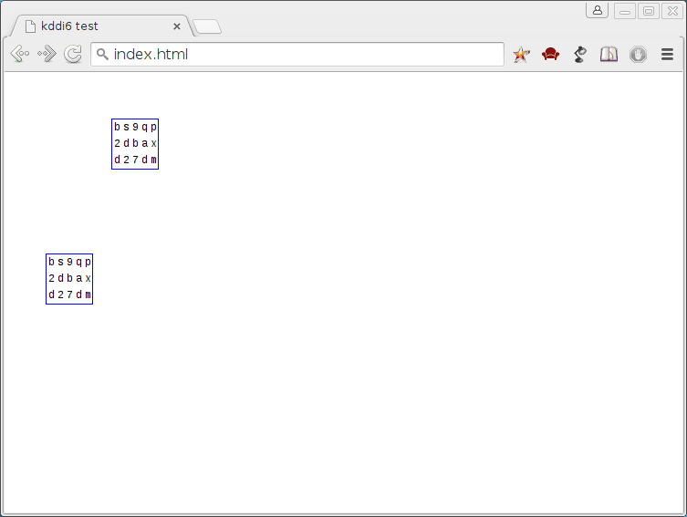

kddi6
=====

Retro WYSIWYG HTML editor

About
-----

This is going to slowly become a state-of-the-art proof of concept WYSIWYG retro editor. Let me explain what all those
big words really mean.

- slowly: I am working on this project when time permits
- state-of-the-art: all the latest and greatest JavaScript + Node.js technologies will be used
- proof of concept: I dreamed up this editing system for HTML documents while walking through the woods, so I am doing
this to see if my ideas will actually work
- WYSIWYG: What You See Is What You Get editor - means that you don't write any markup to produce HTML documents
- retro: the editor will have a feeling as if it is from the days of the console; *nix users will feel right at home = )

Current version
---------------

- Stable: `version 0.1` ([master](https://github.com/valera-rozuvan/kddi6/tree/master) branch)
- Unstable: `version 0.2` ([version-0.2](https://github.com/valera-rozuvan/kddi6/tree/version-0.2) branch)

Demo
----

You can play around with `version 0.1` of `kddi6` at the [demo](http://valera-rozuvan.github.io/kddi6/) page.

Installing
----------

For version 0.1 the installing process is as simple as checking out this repository, and openning up the
file `app/index.html` in a web browser.

TODO
----

What needs to be done. A per version list. [TODO](todo.md).

License
-------

As is the usual with my open source projects, `kddi6` is licensed under the terms of the GNU GENERAL PUBLIC LICENSE
Version 2, June 1991.

See [LICENSE](LICENSE) file for more information.
